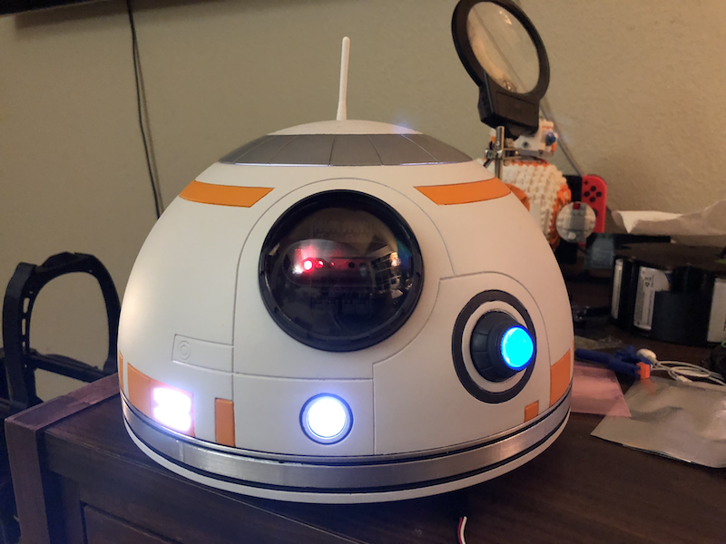
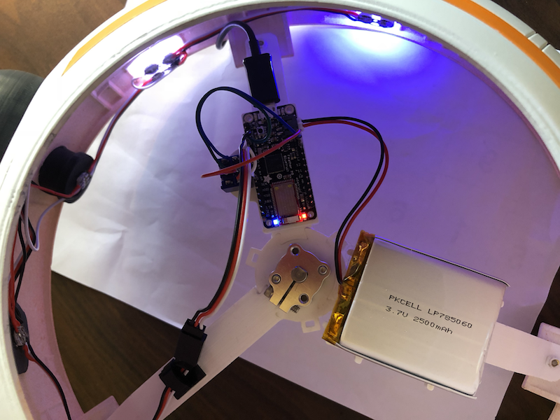

# BB8 Dome



Lighting and communication effects for BB8's dome.

### Hardware Needed
-  [Adafuit Feather M0B Bluefuit](https://www.adafruit.com/product/2995) -
Arduino Zero based chipset with a NRF51 BLE module.  This will communicate with
the body and control all of the pixels.
-  [Neopixel Mini PCB](https://www.adafruit.com/product/1612) - Addresable RGD
LEDs, used in a strip.  Order 2 packs.
-  [Neopixel 5mm Diffused](https://www.adafruit.com/product/1938) - Need on for
the radar eye.
-  [DPDP Switch](https://www.adafruit.com/product/3220) - Used to provide power
to the strip and enable the feather.
-  [Servo Extension Cable](https://www.adafruit.com/product/972) - You need a
few of these or just the wire to connect the Neopixels together.


### Setup
```
Wiring Diagram:       +-------------+
                      | Feather M0  |
                      | (Bluefruit) |
                      |             |
                      |          A5 | ---------------------------------> DATA
                      |             |     +----------------------------> GND
                      |             |     |             DPDT      +----> PWR
               +----  | EN          |     |           +------+    |
               |  +-  | BAT     GND | ----+---------- | o  o |    |
 3.7v LiPo ---------- | JST         |           +---- | o  o | ---+
 (2500mah)     |  |   +-------------+           |     | o  o | ---+
               |  |                             |     +------+    |
               +--------------------------------+                 |
                  |                                               |
                  +-----------------------------------------------+
```


